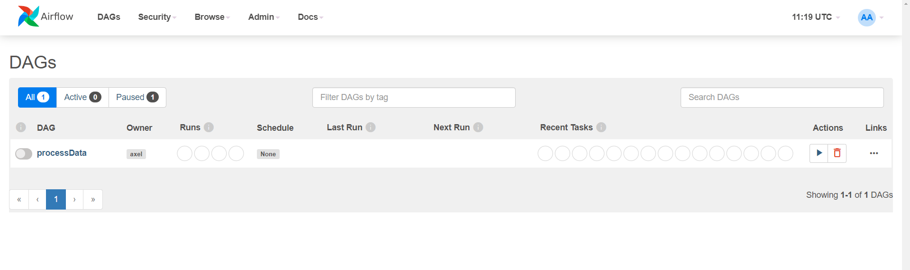
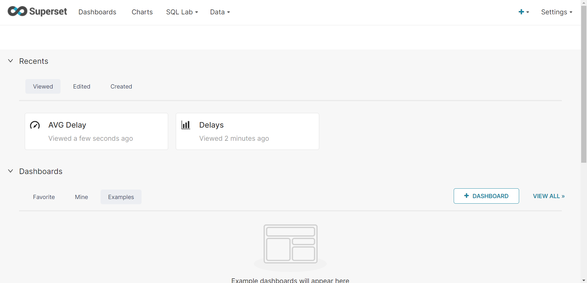

# Airflow ETL With EKS EFS & Sagemaker #

  

[English version](readme_eng.md)

  

## Diagrama de la solución ##

  

[](/images/layout.svg)


## Definición del problema planteado ##


#### Contexto: ####


Acaba de ser contratado como el primer ingeniero de datos de una pequeña empresa de viajes. Su primera tarea para usted fue demostrar el valor y los conocimientos que se pueden generar a partir de las canalizaciones de datos.

Su plan es que una vez que demuestre lo valiosos que pueden ser los datos, comenzarán a invertir en el uso de un proveedor de instancias en la nube. Por ahora, su propia computadora tendrá que hacerlo.

#### Objetivo: ####

Crear un DAG de Airflow que actúe de ETL para extraer extraiga datos estáticos S3 y los cargue en una base de datos de Postgres.

#### Datos a utilizar: ####
  
Para llevar a cabo el desarrollo se utilizará el dataset de demoras y cancelaciones de viajes aéreos de Kaggle que será hosteado en un bucket en S3. Lo primero será obtener los datos siguiendo estos pasos:

* Instalar el cliente de Kaggle: pip install kaggle.

* Instalar el cliente de aws siguiendo estas [instrucciones](https://docs.aws.amazon.com/cli/latest/userguide/getting-started-install.html) acorde a su sistema operativo.

* Instalar el cliente de aws eksctl siguiendo estas [instrucciones](https://docs.aws.amazon.com/eks/latest/userguide/eksctl.html)

* Configurar las credenciales siguiendo estas [instrucciones](https://github.com/Kaggle/kaggle-api#api-credentials).

* Bajar datos de Kaggle:

cd to your local directory

```cd /path/to/dataset/```

<br></br>

```$ mkdir -p minio/data/flights-bucket```

<br></br>

Download zipped dataset from kaggle

```$ kaggle datasets download -d yuanyuwendymu/airline-delay-and-cancellation-data-2009-2018```

<br></br>

Unzip files

``` $ unzip airline-delay-and-cancellation-data-2009-2018.zip -d raw/```

<br></br>

Remove zipped data to save space

``` $ aws s3 sync raw/ s3://ml-dataset-raw-s3/raw/```

<br></br>

Remove zipped data to save space [optional]

```$ rm airline-delay-and-cancellation-data-2009-2018.zip```

  

En este punto al correr el comando el siguiente comando debería aparecer un archivo CSV por año en el directorio de s3:

```aws s3 sync raw/ s3://ml-dataset-raw-s3/raw/```

 

## Desarrollo: ##

1. Se configuro Airflow para que corra en AWS. Esto se puede hacer de varias maneras, pero aquí se desployo dentro de un contenedor de Docker en una virtual machine EC2.

2. Se creo una instancia RDS de Postgres. Esta instancia será utilizada como DB en los puntos siguientes.

3. Se desarrollo un DAG de Airflow con schedule anual que:

○ Se calcula el promedio del tiempo de demora de salida (columna DEP_DELAY) por aeropuerto de salida (columna ORIGIN) y día.

○ Se utilizo un algoritmo de detección de anomalías para identificar por cada aeropuerto si hubo algún día con demoras fuera de lo normal.

○ Se utilizo los datos del punto anterior por cada aeropuerto para producir un gráfico desde Python usando Pandas o Matplotlib en el cual se pueda ver la cantidad de vuelos de cada día con alguna indicación en los días que fueron considerados anómalos.


○ Se carga la data sumarizada junto con un indicador para la fila correspondiente de cada día para indicar si para ese día en un aeropuerto particular las demoras estuvieron fuera de lo esperable. Asimismo los gráficos generados anteriormente son almacenados en S3 en un path fácilmente identificable por año y aeropuerto analizado.


4. Se desarrollo una visualización de los datos cargados. Para ello se utilizó Superset corriendo en otro contenedor de Docker. Se incluye el archivo Docker Compose para levantar la utilidad, junto con un archivo de configuracion con variables de entorno.


Notas:

- El DAG funciona para cualquiera de los años 2009 a 2018 incluidos en el dataset. Se tiene en cuenta que si se corre dos veces para el mismo año podría haber una duplicación de datos y se resolvió.

  
  

## Para levantar la infraestructura ##

  

1. Crear una virtual machine (al menos **t3.large**, y **30gb** de almacenamiento) con Ubuntu 20.04 de SO.

	a. (Opcional) Setar una **elastic IP** para poder acceder de manera mas sencilla.


2. Crear una instancia de **Postgres RDS**, con al menos 5gb de espacio.

  

3. Conectarse via SSH a la virtual machine para configurar el entorno.


	### Docker ###

	a. Instalar Docker	  

	```
	sudo apt-get update
	sudo apt-get install docker.io
	```

	b. Instalar Docker Compose

	```
	sudo apt-get update
	sudo apt-get install docker.io
	```

	### Airflow ###

	c. Clonar la repo en alguna carpeta dentro de la VM
	
	d. Dentro del directorio ```./airflow/dags/db/``` modificar el archivo Pg.py y cambiar los credenciales conectar a la db.

    e. Ingresar a directorio ```./airflow/dags/BLL/resources/``` y con el siguiente comando `````` descargamos los datasets.
	
	d. Iniciar Airflow ejecutando ```docker-compose up``` dentro del directorio de airflow.

	e. Conectarse al terminal del scheduler de Airflow con ```sudo docker exec -u 0 -it airflow_airflow-scheduler_1 bash```
	
	f. Ejecutar ```pip install --no-user --target=/home/airflow/.local/lib/python3.8/site-packages -r ./dags/requirements.txt``` para instalar las librerias de python requeridas.
	
	g. Tras esto podremos (opcionalmente) hostear el puerto :8080 de Airflow con SSH, y entrar a la UI, para allí ejecutar el DAG que se encarga de procesar los datos, cargarlos en Postgres y generar los graficos con los resultados del calculo de anomalias. Como credenciales usamos ```airflow``` de usuario y contraseña.

	> Alli nos econtraremos una interfaz similar a esta:

	[](images/airflow-dashboard.png)

	### Superset ###

	h. Ahora clonaremos la repo de Superset en una nueva carpeta llamada superset. Para ello usamos el siguiente link: ```git clone https://github.com/apache/superset.git```

	i. Copiamos los 2 archivos de la carpeta "superset-setup" a la carpeta de superset. Y ahora ejectuamos ```docker-compose up``` para iniciar los contenedores. Si hosteamos el puerto :8088 via SSH podremos acceder a la UI (usando ```admin``` como usuario, y ```admin``` como contraseña). Dentro de la interfaz podremos configurar las databases, datasets, y crear dashboards con graphs, utilizando los datos cargados desde Airflow.

	> El dashboard de Superset luce similar a esto:
	[](images/superset-dashboard.png)

